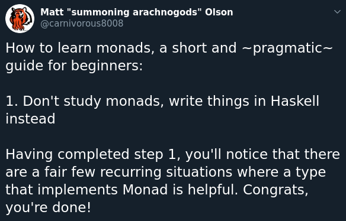

## Участие в курса

Курсът има "неофициални" чат канали във ФМИ Discord-а. Там ще се
* пускат обявления свързани с курса
* обсъждат неофициално неща по курса публично
* обсъждат неофициално неща по курса на лични съобщения с мен

Ще пусна линк покана за Discord-а в Moodle.

Ако някой няма достъп до Moodle курса или иска да участва без да е писал курса, моля да ми пише мейл.

За да участвате в курса, трябва да се свържете с мен за да предприема действия:
* включване в "група" в Discord с която да мога да ви сръчквам за обявления
* взимане на данни нужни за подготовка за домашни и сформиране на таблица с оценки

Това се случва като ми пишете на лично съобщение в Discord, в което да включите две имена, фн и github потребителско име.

## Контакти

* Mail - godzbanebane@gmail.com
* ФМИ Discord - Георги Любенов (googleson78#6163)
* Twitter - Georgi Lyubenov (@googleson78)
* Facebook - Georgi Lyubenov (g.lyubenov78)

## Взимане на курса

Курсът се взима с домашни и проект.

Домашните не са задължителни, проектът е.

Домашните ще са между 3 и 7 на брой.

Домашните ще се предават в лично github репо за всеки човек чрез pull request.

(TODO) споделяне на проекта с главната дисциплина.

Проектът се предава по същия начин както домашните - pull request във вашето репо в github, над който ви пиша feedback.

## Технически детайли

### Инсталиране на Haskell

Имате [няколко варианта](https://www.haskell.org/downloads/):

Можете да използвате [Haskell platform]()-ата. Не препоръчвам ако мислите да пишете Haskell извън курса, но е достатъчно за целите ни тук.

Можете да използвате package manager-а на системата ви.

Можете използвате ghcup:

0. Инсталирате [`ghcup`](https://www.haskell.org/ghcup/) - инструмент за менежиране на Haskell свързани инструменти.
1. `> ghcup install ghc` или алтернативно, `ghcup tui`, след което можете с текстови интърфейс да си изберете какво искате да инсталирате.
2. Проверявате работи ли всичко с командата `ghci`.

### Редактор и интеграция с Haskell

Препоръчаният метод за работа с Haskell е [VSCode](https://code.visualstudio.com/) заедно с [HLS](https://marketplace.visualstudio.com/items?itemName=haskell.haskell) разширението.

То включва много полезни функционалности, така че е хубаво ако ви е интересно да се запознаете повече с документацията му/питате мен въпроси за него.

Важно е да се отбележи, че докато работим с файл извън "проект" (което ще правим повечето време), е **нужно** да имаме инсталирано `ghc` и да е в `PATH` за да работи HLS

Нямам против да ползвате <моя-любим-редактор> - аз ще ползвам `vim` докато ви показвам неща, като най-вероятно можете да си нагласите и HLS да работи с <моя-любим-редактор>. В такъв случай, можете лесно да се сдобиетe със HLS чрез `ghcup`.

Ако решите да не ползвате VSCode, трябва да измислим начин да си споделяте сесията в редактора си с мен, в случай че минем на дистанционно обучение.

## Ресурси

* Донякъде плагиатствам от [този курс](https://github.com/bobatkey/CS316-2021)
* [Книгата](http://www.cs.nott.ac.uk/~pszgmh/pih.html) на която е базиран горният курс (и също я смятам за добър ресурс)
* Хубав talk/demo за неща които често ти се налагат често и как се правят те в Haskell - [цък](https://www.youtube.com/watch?v=idU7GdlfP9Q)
* [Hoogle](https://hoogle.haskell.org/) - търсене за хаскел функции (идентификатори) (и по типове!)
* [Hackage](http://hackage.haskell.org/) - търсене за хаскел пакети
* [Real World Haskell](http://book.realworldhaskell.org/) - практично насочена

  Малко остаряла.

* Специализирани ресурси:

  * защо да правим `a -> Maybe b`, вместо `a -> Bool`:
    * https://lexi-lambda.github.io/blog/2019/11/05/parse-don-t-validate/
    * https://runtimeverification.com/blog/code-smell-boolean-blindness/
    * https://existentialtype.wordpress.com/2011/03/15/boolean-blindness/
  * Мазохизъм/Програмиране с типове - [Thinking with Types](https://thinkingwithtypes.com/)
  * Паралелно и конкуретно програмиране - [Parallel and Concurrent Programming in Haskell](https://simonmar.github.io/pages/pcph.html)
  * Разглеждане на фундаментални типови класове - [Typeclassopedia](https://wiki.haskell.org/Typeclassopedia)
  * Разглеждане на различни интересни библиотеки/разшиерния на езика - [24 days of *](https://ocharles.org.uk/)
  * Има **много** научни статии, които са доста лесно четими дори за начинаещи.

  Можете да ме питате ако ви интересува някоя конкретна тема.

* Монади:

